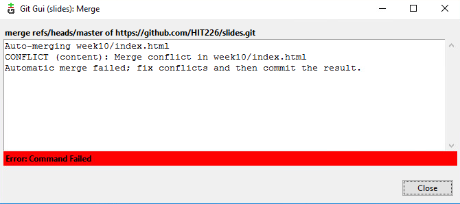
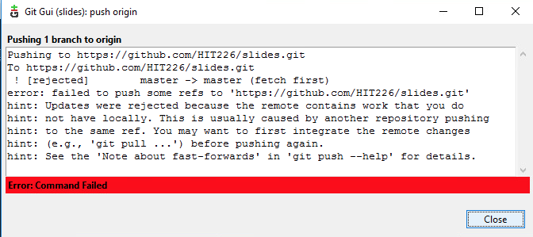
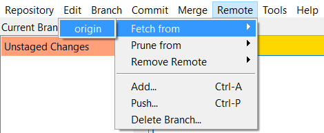
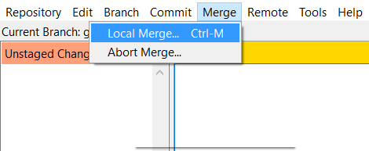
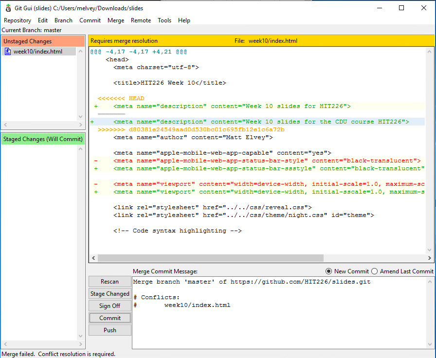
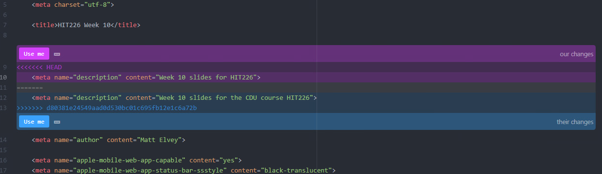
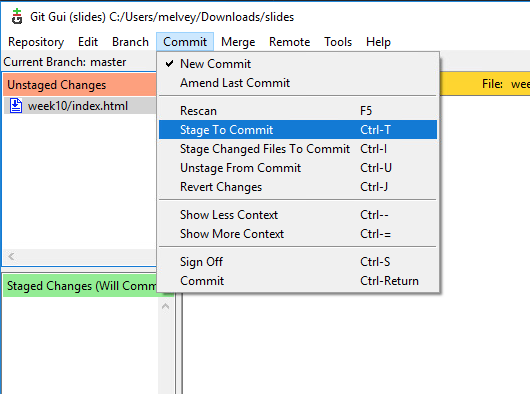
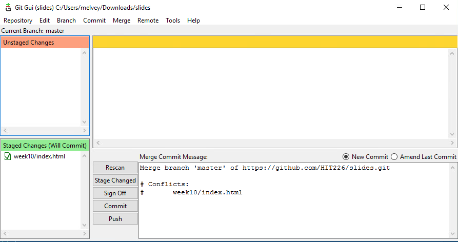
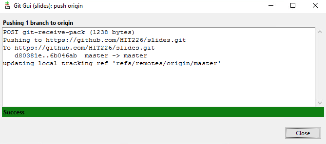

<!-- .slide: data-background-image="../images/bg-mouse.jpg" -->
# Lets Code


<!-- .slide: data-background-image="../images/bg-mouse.jpg" -->
## Git: Branch and Checkout
separately work and Merge at last

You're currently working only in master branch
```git
git push origin master (Master is the branch-name)
```


<!-- .slide: data-background-image="../images/bg-mouse.jpg" -->
### How it works? - 1 
* create separate branch for specific feature
* work on it and commit all own on the same branch


<!-- .slide: data-background-image="../images/bg-mouse.jpg" -->
### How it works? - 2
Checkout - Act of switching between different versions i.e. different branch
* Checkout to Master Branch
* Merge the feature branch to the master


<!-- .slide: data-background-image="../images/bg-mouse.jpg" -->
### More Info
[Git Branch and Checkout Tutorial](https://www.atlassian.com/git/tutorials/using-branches)


<!-- .slide: data-background-image="../images/bg-mouse.jpg" -->
### demo


<!-- .slide: data-background-image="../images/bg-mouse.jpg" -->
### Exercise
* Create a branch name contact-us-form
* add few basic HTML form elements
* checkout and merge with master branch


<!-- .slide: data-background-image="../images/bg-mouse.jpg" -->
## Git: Merge Conflicts


<!-- .slide: data-background-image="../images/bg-mouse.jpg" -->
### Fast-forward error
* Read the message text
* Your code is not up to date with the remote repository
* Someone else has pushed since you last fetched/pulled




<!-- .slide: data-background-image="../images/bg-mouse.jpg" -->
### What do I do??
* Get the latest code (fetch and merge)
 <!-- .element: class="fragment" data-fragment-index="1" -->
 <!-- .element: class="fragment" data-fragment-index="2" -->


<!-- .slide: data-background-image="../images/bg-mouse.jpg" -->
### Merge failed??
* "fix conflicts and then commit the result"


<!-- .slide: data-background-image="../images/bg-mouse.jpg" -->
* If two people have edited the same part of the same file you get a merge conflict
* When you try to merge the file will be modified to include both versions
* You need to manually update this file to select which version you want to keep
* The "diff" will show and lines that have been added and any that have been removed


<!-- .slide: data-background-image="../images/bg-mouse.jpg" -->
## Git: Merge Conflicts



<!-- .slide: data-background-image="../images/bg-mouse.jpg" -->
### Resolve the conflict
* Open the file in Atom
* Find the following line
	* <<<<<<< HEAD
	* Your code will appear after this line
* Find the following line
	* =======
	* The server code will appear after this line
* Find the ending line
	* &gt;&gt;&gt;&gt;&gt;&gt;&gt;
	* This indicates the end of the conflict


<!-- .slide: data-background-image="../images/bg-mouse.jpg" -->
* Edit the text to include the changes you want
* Remember to delete all the marker lines
* Atom has helper buttons in you want to pick only one change



<!-- .slide: data-background-image="../images/bg-mouse.jpg" -->
### Commit your changes
* Clicking "stage all to commit" does not work for merge conflcits
* Select the file then Commit -> Stage to commit
;


<!-- .slide: data-background-image="../images/bg-mouse.jpg" -->
* now commit the merged file



<!-- .slide: data-background-image="../images/bg-mouse.jpg" -->
* You can now push to the server



<!-- .slide: data-background-image="../images/bg-mouse.jpg" -->
### Some tips to minimise conflicts
* Pull before you start work
* Commit and push regularly
* Keep your commits small
	* Work on one thing at a time
	* Your commit message should be a short sentance describing what you've done


<!-- .slide: data-background-image="../images/bg-mouse.jpg" -->
### Exercise
* Create README.md
* In your teams each person modify the heading in README.md
* Everyone try to push your changes at once
* Fix the merge conflicts


<!-- .slide: data-background-image="../images/bg-mouse.jpg" -->
### NEVER force push


<!-- .slide: data-background-image="../images/bg-mouse.jpg" -->
## Advanced Git Commands (Git CLI)
In real world scenario, using Git GUI (ex. Sourcetree) is time consuming
* Developers use Git Commands
* Simple and easy to use


<!-- .slide: data-background-image="../images/bg-mouse.jpg" -->
### git status
Gives the current status of the repository code change.


<!-- .slide: data-background-image="../images/bg-mouse.jpg" -->
### git add
Stages the changes
* git add . : stage all changes in the repository.
* git add {{file-name}} : stage changes made on a particular file.


<!-- .slide: data-background-image="../images/bg-mouse.jpg" -->
### git commit -a -m "this is the commit message"
make a commit 
* -a : staging and commit
* -m : commit message


<!-- .slide: data-background-image="../images/bg-mouse.jpg" -->
### git pull
Pull from remote git repository
* git pull origin master : pull codes from master branch


<!-- .slide: data-background-image="../images/bg-mouse.jpg" -->
### git push
Push from remote git repository
* git push origin master : pull codes from master branch


<!-- .slide: data-background-image="../images/bg-mouse.jpg" -->
### git branch
List all the available branches
* git branch {{name-of-branch}} : Create a branch naming {{name-of-branch}}


<!-- .slide: data-background-image="../images/bg-mouse.jpg" -->
## Finishing up


<!-- .slide: data-background-image="../images/bg-mouse.jpg" -->
### Make a checklist
* Create a checklist of things you need to deliver
* Before handing your project over go through your checklist
* Is there anything you forgot to double check?


<!-- .slide: data-background-image="../images/bg-mouse.jpg" -->
#### Example checklist
* Is your spelling and grammar correct
* Does your website validate
* Does it adhere to best practices
* Make sure there are no broken links
* Do all images work?


<!-- .slide: data-background-image="../images/bg-mouse.jpg" -->
### Have a finishing meeting
* Get together and discuss what you need to do
* Is anything missing?
* Has everyone finished their part?


<!-- .slide: data-background-image="../images/bg-mouse.jpg" -->
### Review your documentation
You might not look at your project again for a while. But what if you have to pick it up in a year?

Ensure your documentation tells you
* Where do you find resources?
* Who do you contact for problems?
* What guidelines does the project follow?
* Does the project have any dependencies?
	* e.g. external resources


<!-- .slide: data-background-image="../images/bg-mouse.jpg" -->
### Walk through the hosted website
* Sometimes things change when you deploy to the server
* Walk through your site and make sure it works
* Do this with your checklist
* Test on multiple devices


<!-- .slide: data-background-image="../images/bg-mouse.jpg" -->
### Iterate so your product is ready to use
* Try and design and develop your MVPs so they are ready to go
* Test your MVP, design a new one and develop it
* You can do this forever but you can also stop any time


<!-- .slide: data-background-image="../images/bg-mouse.jpg" -->
### Learn from the experience
* What lessons have you learned
* What went well?
* What didn't?
* What would you do the same or differenly


<!-- .slide: data-background-image="../images/bg-mouse.jpg" -->
## Coding practice
* write a function that indicates which sections a user has read
* Use the [exercise on codepen](https://codepen.io/elvey/pen/zQwYgW)


