<!-- .slide: data-background-image="images/bg-mouse.jpg" -->
# Skill Up: Code

<!-- .slide: data-background-image="images/bg-mouse.jpg" -->
## Browser and development tools

<!-- .slide: data-background-image="images/bg-mouse.jpg" -->
Plenty of good brower choices

 <!-- .element: class="browser-icon" -->
 <!-- .element: class="browser-icon" -->
 <!-- .element: class="browser-icon" -->

<audio src="audio/browser-intro.ogg"></audio>

Note:
As you’re likely aware the different major browsers have some differences in the features they support and performance. Everyone has their own preferences and so in the workplace we need to test with all the major browsers.

<!-- .slide: data-background-image="images/bg-mouse.jpg" -->
We're going to use chrome

 <!-- .element: class="browser-icon browser-icon_disabled" -->
 <!-- .element: class="browser-icon browser-icon_selected" -->
 <!-- .element: class="browser-icon browser-icon_disabled" -->

* Modern feature set <!-- .element: class="fragment" data-fragment-index="1" -->
* Great development tools <!-- .element: class="fragment" data-fragment-index="1" -->

<audio src="audio/browser-chrome.ogg"></audio>

Note:
To make things simple, we’re just going to use Chrome for this class. Chrome has a very modern feature set and great development tools that will make our work much easier. Let’s get to know the features.

<!-- .slide: data-background-image="images/bg-mouse.jpg" -->
### Chrome Developer tools: DOM Inspector
<video>
	<source data-src="videos/open-dev-tools.webm" type="video/webm" />
</video>
<audio src="audio/dom-inspector-intro.ogg"></audio>

Note:
Click the elements tab and look at the contents. It should look just like HTML you wrote for the exercise. This is not the same as the source code though as it represents the elements currently on the page. If you used javascript to add or remove an element it would appear here. This is a representation of the Document Object Model or DOM. You can just think of the DOM as how the browser keeps track of what’s on the page.

<!-- .slide: data-background-image="images/bg-mouse.jpg" -->
### Chrome Developer tools: DOM Inspector
<video>
	<source data-src="videos/dev-tools-elements.webm" type="video/webm" />
</video>
<audio src="audio/dom-inspector-explore.ogg"></audio>

Note:
Expand the page elements if they are not already by clicking on the little arrows. Notice how the view of your page highlights the element you are currently hovering over? This makes it easy to see where the element sits as well as any padding, margins or borders. On the right you can see the CSS for the element.

<!-- .slide: data-background-image="images/bg-mouse.jpg" -->
### Chrome Developer tools: DOM Inspector
<video>
	<source data-src="videos/dev-tools-edit-style.webm" type="video/webm" />
</video>
<audio src="audio/dom-inspector-demo.ogg"></audio>

Note:
You can do quite a lot from the elements tab. Here you can see me selecting a heading on the page, changing the font size and giving it a new colour. It’s a really easy way to change page elements around and see how they’ll look.

<!-- .slide: data-background-image="images/bg-mouse.jpg" -->
### Chrome Developer tools: DOM Inspector
* Explore your dom
* Give some elements a border to see where they sit
	<pre><code class="css">border: 1px solid black;</code></pre>
* Drag some elements in to others
* Can you edit the text of a heading?
* What happens when you refresh? Why?

<!-- .slide: data-background-image="images/bg-mouse.jpg" -->
### Chrome Developer tools: Network
* View all HTTP requests the page makes <!-- .element: class="fragment" data-fragment-index="1" -->
* View files downloaded <!-- .element: class="fragment" data-fragment-index="2" -->
* View REST requests and responses <!-- .element: class="fragment" data-fragment-index="3" -->

<audio src="audio/network-intro.ogg"></audio>

Note:
The network tab shows us all the network requests the page makes. We can see all the files the page needs, including images, css and javascript as well as any requests made by javascript to load or send additional data.

<!-- .slide: data-background-image="images/bg-mouse.jpg" -->
### Chrome Developer tools: Network
<video>
	<source data-src="videos/dev-tools-network.webm" type="video/webm" />
</video>

<!-- .slide: data-background-image="images/bg-mouse.jpg" -->
### Chrome Developer tools: Network
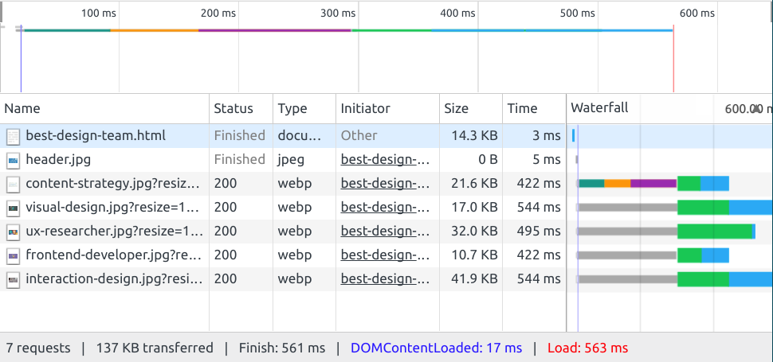

<audio src="audio/network-usage.ogg"></audio>

Note:
Open the network tab and reload the page. You will see a list of files appear. Each of these is a seperate HTTP request. They include the original HTML document as well as any images, stylesheets or scripts the page requires. You can also see when the page requests more data from a server.

<!-- .slide: data-background-image="images/bg-mouse.jpg" -->
### Chrome Developer tools: Network timeline
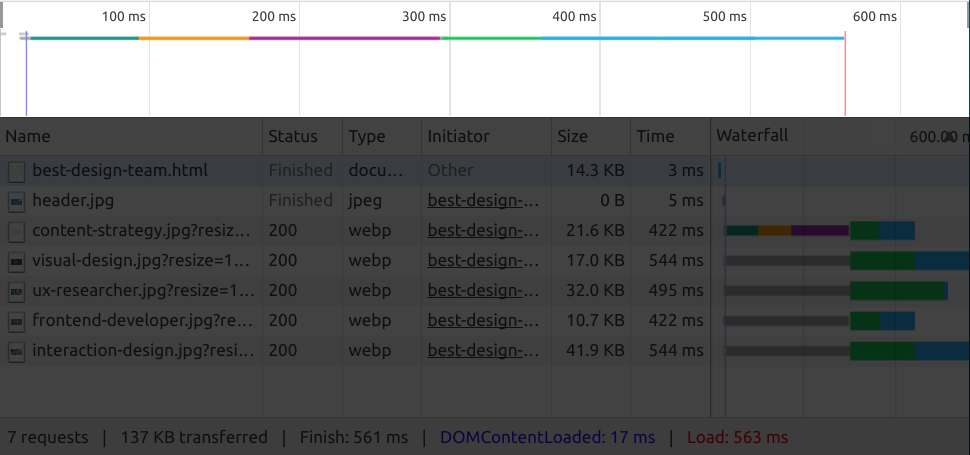

<audio src="audio/network-timeline.ogg"></audio>

Note:
The timeline shows when it loaded different resources and how long they took. If you have a really big script or image that is making everything slow to load you can see it here.

<!-- .slide: data-background-image="images/bg-mouse.jpg" -->
### Chrome Developer tools: Network requests
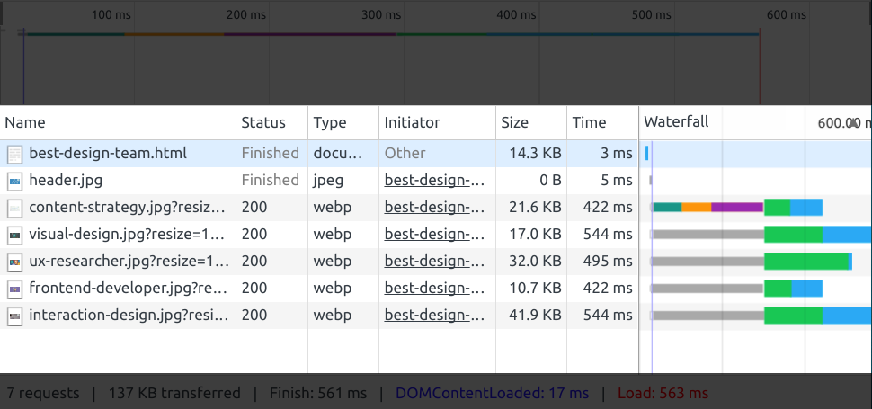

<audio src="audio/network-requests.ogg"></audio>

Note:
The request window shows you all the requests made. It shows you the file or resource requested, the response code, what initiated the request, how big the file is and how long it took to download.

<!-- .slide: data-background-image="images/bg-mouse.jpg" -->
### Chrome Developer tools: Network details
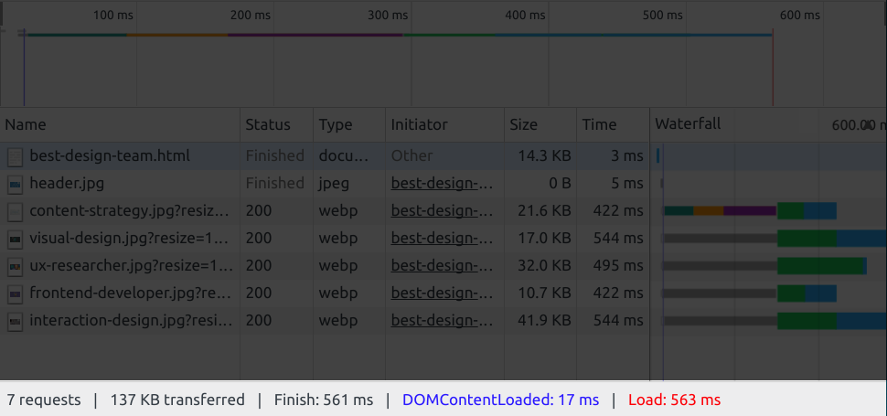

<audio src="audio/network-details.ogg"></audio>

Note:
The bottom panel tells you how big the page is and how long it took to download and load. What do you are the difference between Finish, DOMContentLoaded and Load?

<!-- .slide: data-background-image="images/bg-mouse.jpg" -->
### Chrome Developer tools: Web console

<audio src="audio/web-console.ogg"></audio>

Note:
The console is where any page errors or javascript output appear. There probably isn't much for your pages. But this is really useful once you start using javascript. We'll come back to this later in the course.

<!-- .slide: data-background-image="images/bg-mouse.jpg" -->
### Chrome Developer tools: Activity
* Open a favourite website with dev tools open
* How big is the page?
* How long did it take to download?
* Did it download a lot of files or not many
* Are there any errors or warnings in the console?
* Have a look through the elements to learn the page structure
* Report back to the class on what you find

<!-- .slide: data-background-image="images/bg-mouse.jpg" -->
## Atom Editor

<audio src="audio/atom-intro.ogg"></audio>

Note:
For this course we're going to use Atom. There are a lot of different text editors available and lots are people are pretty dedicated to their favourite. If you already have a favourite feel free to use that. But for those getting starting we recommend using atom

<!-- .slide: data-background-image="images/bg-mouse.jpg" -->
### Why use atom
* Cross platform
* Configurable (HTML & CSS)
* Easy to setup and learn
* Package manager
* Cool features
	* Syntax highlighting
	* Smart autocomplete
	* Search and browse project files
	* Git integration

<audio src="audio/atom-why.ogg"></audio>

Note:
Atom is a cross platform, customisable text editor for coding. It is easy to setup and get started with but lets you complately configure the look and feel using HTML and CSS and to extend the functionality with plugins. It also comes with a lot of useful features out of the box like autocomplete, syntax highlighting and project wide search.
It is also really customisable using web languages. You can change the whole application theming using just CSS!

<!-- .slide: data-background-image="images/bg-mouse.jpg" -->
<video>
	<source data-src="videos/atom-intro.webm " type="video/webm" />
</video>

<!-- .slide: data-background-image="images/bg-mouse.jpg" -->
### Atom: Activity
* Open atom and add the document you made before class as a project
* Explore atom features
	* Open settings menu (ctl+,)
	* Explore features in the command palette (ctl+shift+p)
	* Explore keyboard shortcuts from a list like [https://gist.github.com/chrissimpkins/5bf5686bae86b8129bee](https://gist.github.com/chrissimpkins/5bf5686bae86b8129bee)

<!-- .slide: data-background-image="images/bg-mouse.jpg" -->
Share what you found

<!-- .slide: data-background-image="images/bg-mouse.jpg" -->
### Atom plugins
* Open the settings menu (ctl+,) and select install
* Type in devdocs and install the package
* Now go to your html document and select a tag name
* Press ctl+alt+D to open the documentation for that tag from [https://devdocs.io](devdocs.io)

<!-- .slide: data-background-image="images/bg-mouse.jpg" -->
## HTML Validation

<!-- .slide: data-background-image="images/bg-mouse.jpg" -->
### Why validate
* Identify mistakes
	* Typos
	* Unclosed tags
	* Missing doctype
	* Weird stuff

<audio src="audio/validate-why.ogg"></audio>

Note:
If you make a mistake in your HTML the browser will guess what you were trying to do and show that. This means that sometimes you don’t notice if you forgot to close a tag or used an invalid property. Unfortunately, because the browsers guess what they think you’re trying to do it might not be what you intended and might not work the same in all browsers. To address this we can validate our HTML.

<!-- .slide: data-background-image="images/bg-mouse.jpg" -->
<video>
	<source data-src="videos/html-validator.webm" type="video/webm" />
</video>

<audio src="audio/validate-demo.ogg"></audio>

Note:
Here I'm validating my HTML using the W3C validator. You can see I've made some mistakes. I accidently included an extra < in an img tag and forgot to close some tags

<!-- .slide: data-background-image="images/bg-mouse.jpg" -->
### Validation Exercise
* Visit [https://validator.w3.org/](https://validator.w3.org/)
* Validate your page by direct input
* Discuss what you found

<!-- .slide: data-background-image="images/bg-mouse.jpg" -->
## Semantic HTML
* HTML describes the structure of the page <!-- .element: class="fragment" data-fragment-index="1" -->
* Semantic HTML adds meanining <!-- .element: class="fragment" data-fragment-index="1" -->
* Not about look and feel <!-- .element: class="fragment" data-fragment-index="1" -->

<audio src="audio/semantic-intro.ogg"></audio>

Note:
HTML represents the content and structure of a page. We spend so much time thinking about what the page looks like that we sometimes forget this. But when writing HTML we shouldn’t be thinking about the visual layout so much as the structural layout.

<!-- .slide: data-background-image="images/bg-mouse.jpg" -->
### Why do semantics matter
* Bots and SEO
* Vision impaired users
* People with arthritis
* Someone eating a sandwich
* Developers picking up your code (you)

<audio src="audio/semantic-why.ogg"></audio>

Note:
Not everyone looks at a page as we see it rendered. Just as not everyone navigates it with a keyboard and a mouse. A well structured page pages it easier to parse and navigate for all users. Some examples of users we might want to consider.

<!-- .slide: data-background-image="images/bg-mouse.jpg" -->
### Semantic elements
Describe what is in the tag
* form
* img
* table
* ul

<audio src="audio/semantic-elements-old.ogg"></audio>

Note:
Semantic elements describe what sort of data is in the element. Some you might have seen include the form element, which says this is an input form, the image element which describes an image, table elements which tell us we're looking at tabular data and a ul element which describes a list of items where the order does not matter.

<!-- .slide: data-background-image="images/bg-mouse.jpg" -->
### New HTML5 semantic elements
* header
* main
* footer
* nav
* section
* article

<audio src="audio/semantic-elements-html5.ogg"></audio>

Note:
HTML5 bought us a lot of new semantic elements. The big changes are the structural elements that tells us where the content belongs in the page structure. What do you think these mean?

<!-- .slide: data-background-image="images/bg-mouse.jpg" -->
### Semantics Activity
* Have a look at the element list at [https://developer.mozilla.org/en-US/docs/Web/Guide/HTML/Content_categories#Flow_content](https://developer.mozilla.org/en-US/docs/Web/Guide/HTML/Content_categories#Flow_content)
* Look at the flowchart at [http://html5doctor.com/downloads/h5d-sectioning-flowchart.png](http://html5doctor.com/downloads/h5d-sectioning-flowchart.png)
* Update your HTML to use the new semantic elements

<!-- .slide: data-background-image="images/bg-mouse.jpg" -->
### Questions
* When do you think you should use a div element?
* How should you name a new section?
* What do you think about the new semantic elements?
	* Too many
	* Not enouch
	* Too confusing?

<!-- .slide: data-background-image="images/bg-mouse.jpg" -->
### Final thoughs
<blockquote cite="http://html5doctor.com/lets-talk-about-semantics/">
	
Don&#39;t think of &lt;article&gt; as a magazine article. Think of it as an article of clothing, an independent entity that can be arranged in conjunction with other articles of clothing, but is a complete thing in itself.

	<footer><a href="http://html5doctor.com/lets-talk-about-semantics/">Bruce Lawson</a></footer>
</blockquote>

<!-- .slide: data-background-image="images/bg-mouse.jpg" -->
## Git

<!-- .slide: data-background-image="images/bg-mouse.jpg" -->
### What is git
* Source control
* Version control
* Distributed

<audio src="audio/git-what.ogg"></audio>

Note:
Git is a distributed source and version control platform. It tracks changes to our files and stores those changes on a server. 

<!-- .slide: data-background-image="images/bg-mouse.jpg" -->
### Why use git
* Store and share source code
* Tracks changes and versions over time
	* Can go back if we broke something
* Allows multiple people to work on the same code without disrupting eachother

<audio src="audio/git-why.ogg"></audio>

Note:
Tracking our code changes on git makes it easy to share and prevents us from trying to manage multiple versions when we're trying something new. If you broke something, you can just go revert your code back to an earlier state. Because it stores changes, instead of the whole file, it also makes it easier for multiple people to work on the same code without breaking eachother's work.

<!-- .slide: data-background-image="images/bg-mouse.jpg" -->
### Git functions
* Clone - Copy a repository to our local machine
* Add - Stage a file to commit
* Commit - Store a code change in git
* Push - send our code changes to the server
* Fetch - Get code from the server
* Merge - Mix new code in with ours or vice versa
* Rebase - Like merge but different

<audio src="audio/git-functions.ogg"></audio>

Note:
This are some common git functions. Don't worry, you don't need to learn them all now. You might also hear git pull. This is a shortcut command to fetch and merge

<!-- .slide: data-background-image="images/bg-mouse.jpg" -->
### Github
* A public git server
* A place to publish and share your code
* A place to find and download code other people have written
* A platform to submit code changes to open source projects

<audio src="audio/git-github.ogg"></audio>

Note:
Github is a public git server. We're going to use it in this course to track our projects. It is a public place to publish and share your code. IT is also a great place to find and download code that other people have written. It's also great to share on your CV as it shows what you can do.

<!-- .slide: data-background-image="images/bg-mouse.jpg" -->
### Activity: Setup a git repository
* Register for github
* Create a new repository for the unit
* Create a folder in the repository for week 1

<!-- .slide: data-background-image="images/bg-mouse.jpg" -->
### WinGit client
* Lots of clients available
* Download from [https://git-scm.com/](https://git-scm.com/)
* GUI with Git GUI and command prompt with Git Bash

<audio src="audio/git-wingit.ogg"></audio>

Note:
There are a lot of git clients about. For those of you on windows, I'd suggest using Git GUI for windows or the git client built in to Atom

<!-- .slide: data-background-image="images/bg-mouse.jpg" -->
#### Clone a repository
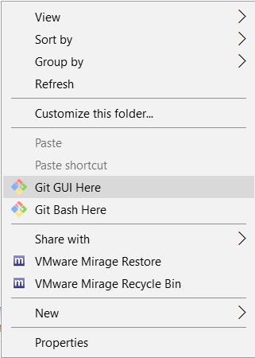 <!-- .element: class="screenshot-small fragment current-visible" data-fragment-index="1" -->
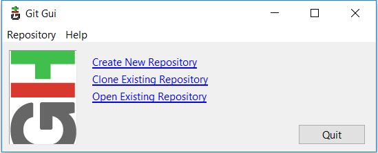 <!-- .element: class="screenshot-small fragment current-visible" data-fragment-index="2" -->
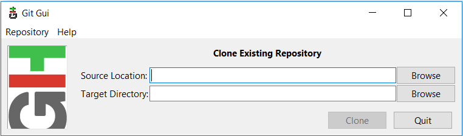 <!-- .element: class="screenshot-small fragment current-visible" data-fragment-index="3" -->

<audio src="audio/git-clone.ogg"></audio>

Note:
To clone an existing repository to your computer, right click where you want to clone it and select "Git GUI here". Select "Clone existing repository" and enter the git address in "Source Location". Enter the path you want to clone to in "Target directory". Note that the final directory in target directory should not exist as git will create it for you.

<!-- .slide: data-background-image="images/bg-mouse.jpg" -->
#### Fetch changes
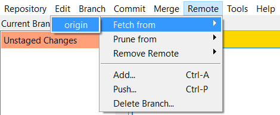 <!-- .element: class="fragment" data-fragment-index="1" -->
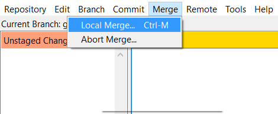 <!-- .element: class="fragment" data-fragment-index="2" -->

<audio src="audio/git-merge.ogg"></audio>

Note:
To get the latests changes from the server open Git GUI, select "Remote" from the menu, "Fetch from" then "origin". This downloads the latests changes from the server. To mix the changes in with your code select the "Merge" menu then "Local merge". Now your code is up to date.

<!-- .slide: data-background-image="images/bg-mouse.jpg" -->
### Commit and Push
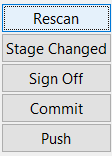 <!-- .element: class="fragment" data-fragment-index="1" -->
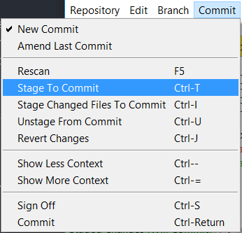 <!-- .element: class="fragment" data-fragment-index="2" -->
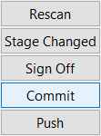 <!-- .element: class="fragment" data-fragment-index="3" -->
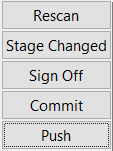 <!-- .element: class="fragment" data-fragment-index="4" -->

<audio src="audio/git-commit.ogg"></audio>

Note:
When you finish you'll need to commit to save your work and push to send them to the server. From Git GUI select "rescan" to search for changed files. You should see a list of modified files appear. Now open the Commit menu and select "Stage to commit". Now your files are staged you can commit them to the repository. Enter a description of what has changed in the "Commit Message" field and click the "commit button". Your changes are now saved". Click the push button to send your changes to the server.

<!-- .slide: data-background-image="images/bg-mouse.jpg" -->
### Activity: Git local repository
* Clone the project to your local machine
	* You can get the address from the green clone button on github
* Copy your html and any required files to the week one directory
* Add the new files to git
* Commit the staged files with the comment "Add week one files"
* Push your code and check it appears on the github website

<!-- .slide: data-background-image="images/bg-mouse.jpg" -->
### Some tips
* Fetch from the server before you start writing
* Push whenever you finish writing
* A commit should be self-contained
	* If you are editing multiple files, include them all
	* Keep them small so it is easy to see what has changed
	* It is better to commit too much rather than not enough
	* Try not to break things
