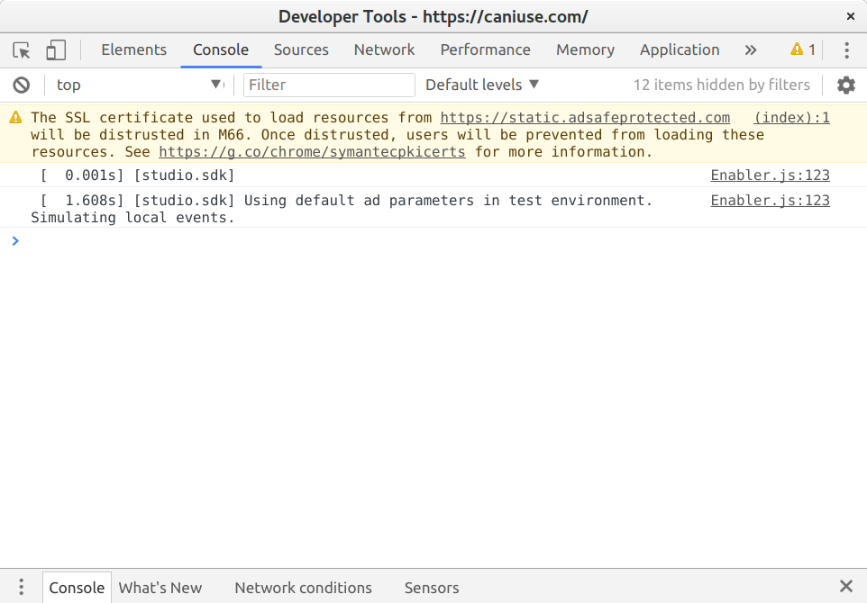

<!-- .slide: data-background-image="../images/bg-mouse.jpg" -->
# <span>Skill Up:</span> <span>Code</span>


<!-- .slide: data-background-image="../images/bg-mouse.jpg" data-audio-src="audio/devtools-1.ogg" -->
### Chrome Developer tools: Getting started
<video>
	<source data-src="videos/open-dev-tools.webm" type="video/webm" />
</video>


<!-- .slide: data-background-image="../images/bg-mouse.jpg" data-audio-src="audio/dom-inspector-intro.ogg" -->
### Chrome Developer tools: DOM Inspector


Note:
Click the elements tab and look at the contents. It should look just like HTML you wrote for the exercise. This is not the same as the source code though as it represents the elements currently on the page. If you used javascript to add or remove an element it would appear here. This is a representation of the Document Object Model or DOM. You can just think of the DOM as how the browser keeps track of what’s on the page.


<!-- .slide: data-background-image="../images/bg-mouse.jpg" data-audio-src="audio/dom-inspector-explore.ogg" -->
### Chrome Developer tools: DOM Inspector
<video>
	<source data-src="videos/dev-tools-elements.webm" type="video/webm" />
</video>

Note:
Expand the page elements if they are not already by clicking on the little arrows. Notice how the view of your page highlights the element you are currently hovering over? This makes it easy to see where the element sits as well as any padding, margins or borders. On the right you can see the CSS for the element.


<!-- .slide: data-background-image="../images/bg-mouse.jpg" data-audio-src="audio/dom-inspector-demo.ogg" -->
### Chrome Developer tools: DOM Inspector
<video>
	<source data-src="videos/dev-tools-edit-style.webm" type="video/webm" />
</video>

Note:
You can do quite a lot from the elements tab. Here you can see me selecting a heading on the page, changing the font size and giving it a new colour. It’s a really easy way to change page elements around and see how they’ll look.


<!-- .slide: data-background-image="../images/bg-mouse.jpg" -->
### Chrome Developer tools: DOM Inspector
* Explore your dom
* Give some elements a border to see where they sit
	<pre><code class="css">border: 1px solid black;</code></pre>
* Drag some elements in to others
* Can you edit the text of a heading?
* What happens when you refresh? Why?


<!-- .slide: data-background-image="../images/bg-mouse.jpg" data-audio-src="audio/network-intro.ogg" -->
### Chrome Developer tools: Network
* View all HTTP requests the page makes <!-- .element: class="fragment" data-fragment-index="1" -->
* View files downloaded <!-- .element: class="fragment" data-fragment-index="2" -->
* View REST requests and responses <!-- .element: class="fragment" data-fragment-index="3" -->

Note:
The network tab shows us all the network requests the page makes. We can see all the files the page needs, including images, css and javascript as well as any requests made by javascript to load or send additional data.


<!-- .slide: data-background-image="../images/bg-mouse.jpg" -->
### Chrome Developer tools: Network
<video>
	<source data-src="videos/dev-tools-network.webm" type="video/webm" />
</video>


<!-- .slide: data-background-image="../images/bg-mouse.jpg" data-audio-src="audio/network-usage.ogg" -->
### Chrome Developer tools: Network


Note:
Open the network tab and reload the page. You will see a list of files appear. Each of these is a seperate HTTP request. They include the original HTML document as well as any images, stylesheets or scripts the page requires. You can also see when the page requests more data from a server.


<!-- .slide: data-background-image="../images/bg-mouse.jpg" data-audio-src="audio/network-timeline.ogg" -->
### Chrome Developer tools: Network timeline


Note:
The timeline shows when it loaded different resources and how long they took. If you have a really big script or image that is making everything slow to load you can see it here.


<!-- .slide: data-background-image="../images/bg-mouse.jpg" data-audio-src="audio/network-requests.ogg" -->
### Chrome Developer tools: Network requests


Note:
The request window shows you all the requests made. It shows you the file or resource requested, the response code, what initiated the request, how big the file is and how long it took to download.


<!-- .slide: data-background-image="../images/bg-mouse.jpg" data-audio-src="audio/network-details.ogg" -->
### Chrome Developer tools: Network details


Note:
The bottom panel tells you how big the page is and how long it took to download and load. What do you are the difference between Finish, DOMContentLoaded and Load?


<!-- .slide: data-background-image="../images/bg-mouse.jpg" data-audio-src="audio/web-console.ogg" -->
### Chrome Developer tools: Web console


Note:
The console is where any page errors or javascript output appear. There probably isn't much for your pages. But this is really useful once you start using javascript. We'll come back to this later in the course.


<!-- .slide: data-background-image="../images/bg-mouse.jpg" -->
### Chrome Developer tools: Activity
* Open a favourite website with dev tools open
* How big is the page?
* How long did it take to download?
* Did it download a lot of files or not many
* Are there any errors or warnings in the console?
* Have a look through the elements to learn the page structure
* Report back to the class on what you find


<!-- .slide: data-background-image="../images/bg-mouse.jpg" -->
## Document Object Model


<!-- .slide: data-background-image="../images/bg-mouse.jpg" -->
### What is the DOM?
* Not HTML
* What you see in dev tools
* Browser representation of the document and elements
* Can be modified after page load

Note:
the DOM is not the HTML you write or get from view source. But that is used to create it.
The DOM is what you see in dev tools. It looks like HTML but that’s just a way to represent it.
The DOM is the browser representation of the document and the elements that make it up. The main difference between the DOM and your HTML is that the DOM can be manipulated after the page has loaded. We’ll go into that when we get to javascript. For now, let’s talk about the structure


<!-- .slide: data-background-image="../images/bg-mouse.jpg" -->
### Parents, Children and Siblings


Note:
When we “walk” or traverse the DOM we walk down to the “children” of an element, across to the “siblings” and up to the “parents”. We also use these terms when we talk about CSS selectors so it is worth understanding the terminology.


<!-- .slide: data-background-image="../images/bg-mouse.jpg" -->
* Common terminology
	* "walk up" to parents
	* "walk down" to children
	* "walk across" to siblings


<!-- .slide: data-background-image="../images/bg-mouse.jpg" -->
## Tree structure

<p class="attribution">By Birger Eriksson (Own work) [<a href="https://creativecommons.org/licenses/by-sa/3.0">CC BY-SA 3.0</a>], via Wikimedia Commons</a>

Note:
These parent relationships make for an intuitive tree structure. You can think of the DOM as a tree of nodes, with document as the root node.Under document you would find html which would have the body and head nodes branching off it. Lets draw this code as a DOM tree


<!-- .slide: data-background-image="../images/bg-mouse.jpg" -->
* A tree of nodes
* Document is the root node
* html under document
* body under html


<!-- .slide: data-background-image="../images/bg-mouse.jpg" -->
### Activity: Draw the tree
```
<html>
	<head>
		<title>My page</title>
	</head>
	<body>
		<main>
			<article>
				<h2>My article</h2>
				<section>
					<h2>My section</h2>
					<p>My text</p>
				</section>
			</article>
		</main>
	</body>
</html>
```


<!-- .slide: data-background-image="../images/bg-mouse.jpg" -->
### Rendered

* Children usually appear inside their parents
* Like boxes in boxes

Note:
As a general rule (with lots of exceptions) each element should appear inside the parent. Yes, it is easy to make it appear outside with CSS but the are usually logically nested as content. You could think of them as boxes inside boxes. So this DOM tree will look like this


<!-- .slide: data-background-image="../images/bg-mouse.jpg" -->
### Draw the page
```
<html>
	<head>
		<title>My page</title>
	</head>
	<body>
		<main>
			<article>
				<h2>My article</h2>
				<section>
					<h2>My section</h2>
					<p>My text</p>
				</section>
			</article>
		</main>
	</body>
</html>
```

Note::
It’s hard work to make a page if you just use trial and error. Fortunately the DOM renders pretty intuitively. Have a look at this page and try to draw it it groups of threes. Talk about why you think it works. We’ll bring some up to look at when you finish.


<!-- .slide: data-background-image="../images/bg-mouse.jpg" -->
## CSS


<!-- .slide: data-background-image="../images/bg-mouse.jpg" -->
## Do you have style?
* clone the the [hair salon repository](https://github.com/HIT226/hairstyle-salon)
	* Open in your browser
	* What does it look like?
	* Attach a stylesheet

```html
	<link rel="stylesheet" href="css/style.css" type="text/css">
```


<!-- .slide: data-background-image="../images/bg-mouse.jpg" -->
## CSS Selectors


<!-- .slide: data-background-image="../images/bg-mouse.jpg" -->
### Overview
* A selector directly targets an HTML element
* There are many types
* We'll cover the most commonly used

Note:
A selector is like a query string for your DOM. We use them in CSS to select the elements we want to style


<!-- .slide: data-background-image="../images/bg-mouse.jpg" -->
### What do you already know
* What type of selectors can you name?


<!-- .slide: data-background-image="../images/bg-mouse.jpg" -->
### Element selectors
* Uses the HTML element name
* Selects every instance of this element in the HTML file
* Position in tree is irrelevant
```css
	p {color: #003300;}
```
* All paragraph elements are styled


<!-- .slide: data-background-image="../images/bg-mouse.jpg" -->
### Class selectors
* Selects any element that has a relevant class name
* Regardless of the element's position in the tree
```css
	.title {font-size: 130%;}
```


<!-- .slide: data-background-image="../images/bg-mouse.jpg" -->
## Combination selectors
* A combination of the element name and a class attribute
* Position in tree is again irrelevant
```html
<h2 class="title">
```
```css
h2.title{font-size: 130%;}
```


<!-- .slide: data-background-image="../images/bg-mouse.jpg" -->
### ID Selectors
* Selects any element that has the relevant ID name
* Regardless of the element's position in the tree
```js
#unique_title{font-size: 130%;}
```


<!-- .slide: data-background-image="../images/bg-mouse.jpg" -->
### Combination ID selectors
* A combination of the element name and an ID attribute
* Position in tree is again irrelevant
```html
<h2 id="unique_title">Title</h2>
```
```css
h2#unique_title {font-size: 130%;}
```

Note:
Why is this no more useful than an element selector?


<!-- .slide: data-background-image="../images/bg-mouse.jpg" -->
### Descendant selectors
* Uses the document tree to isolate and target specific elements


<!-- .slide: data-background-image="../images/bg-mouse.jpg" -->
### Descendants continued
* This targets only a elements (anchor elements) that are descendants of p elements in the HTML file
```css
   p a {color: #aacc33; }
 ```
```html
	<!-- Matched -->
	 <p> <a href="#">Here's an image</a> </p> 

	<!-- Not matched -->
	 <h3><a href="#">Here's an image</a></h3>
```


<!-- .slide: data-background-image="../images/bg-mouse.jpg" -->
### Descendants continued
* These selectors can go down multiple levels of an HTML document tree
```html
<ul> <li> <a>  </a> </li> </ul>
```

* To style the img element you could use any of these
```css
ul li a img {}
ul li img {}
ul img {}
```


<!-- .slide: data-background-image="../images/bg-mouse.jpg" -->
### Descendants continued
* It's considered best practice to minimise the usage of descendants, as a rule of thumb try to limit yourself to three selectors deep
* Use classes to break up deep structures into smaller pieces


<!-- .slide: data-background-image="../images/bg-mouse.jpg" -->
### Child selectors
* When you want to target an element directly down the tree from another element
* Use a chevron (>) sign
```html
<p>Here is a <span> red </span> balloon.</p>
```
```css
p > span {color: red; }
```
* Targets only the span element directly inside p elements
* span is the child of p


<!-- .slide: data-background-image="../images/bg-mouse.jpg" -->
### Sibling selectors
* When you want to target an element based on it's siblings
	* General sibling selector
	* Use tilde (~)
	* Matches siblings based on the selector it precedes 
* Adjacent sibling selector or next-sibling selector
	* Use +
	* Matches next siblings based the selector it precedes 


<!-- .slide: data-background-image="../images/bg-mouse.jpg" -->
### Sibling selectors
```html
<ul>
	<li>List item</li>
	<li>List item</li>
	<li class="test">List item</li>
	<li>List item</li>
	<li>List item</li>
</ul>
```
```css
.test ~ li{} /*Matches fourth and last li*/ 
.test + li{} /*Matches only last li*/ 
```


<!-- .slide: data-background-image="../images/bg-mouse.jpg" -->
### Universal selector
* Written using an asterisk  -  *
* Selects all elements

```css
* {} /* all elements/nodes from html down */

p * {} /* all nodes within a p */
```


<!-- .slide: data-background-image="../images/bg-mouse.jpg" -->
### Combining selectors
* Use a seperator to use multiple selectors
* Select elements from each selector
```
input,
textarea {
	color: #dc143c;
}
```


<!-- .slide: data-background-image="../images/bg-mouse.jpg" -->
### Pseudo selectors
* Special selectors 
* Can select elements by position or state

```css
li:first-child {} /* The first li in the group */

input::active {} /* The currently active input element */
```


<!-- .slide: data-background-image="../images/bg-mouse.jpg" -->
### Eyes on the road
* CSS can't "look back", so you can never target an item based on it's children or on items that come after it


<!-- .slide: data-background-image="../images/bg-mouse.jpg" -->
### Eyes on the road
* We can't select the first or second li's based on .test
* We also can not select the ul with a child of .test
```html
<ul>
	<li>List item</li>
	<li>List item</li>
	<li class="test">List item</li>
	<li>List item</li>
	<li>List item</li>
</ul>
```


<!-- .slide: data-background-image="../images/bg-mouse.jpg" -->
### Activity: Eat at the CSS Diner
* Open the [CSS Diner](https://flukeout.github.io/)
* How far can you get?


<!-- .slide: data-background-image="../images/bg-mouse.jpg" -->
### CSS Best Practices
 

<!-- .slide: data-background-image="../images/bg-mouse.jpg" -->
### What is best practice
* "Best practice" often comes down to personal opinion.
* "Best practice" can depend on the team environment you are working in.
* "Best practice" can also depend on the applications you have to work with
* Your personal "best practices" will  change radically over time.


<!-- .slide: data-background-image="../images/bg-mouse.jpg" -->
### What do you think are good best practices?


<!-- .slide: data-background-image="../images/bg-mouse.jpg" -->
### Some common practices
* Avoid inline styles
* Avoid header styles
* Minimise number of stylesheets
* Avoid ID selectors


<!-- .slide: data-background-image="../images/bg-mouse.jpg" -->
## Our CSS Best Practices


<!-- .slide: data-background-image="../images/bg-mouse.jpg" -->
### Avoid duplicate selectors
```css
/* Good */
p {
	margin-left 15px;
	background-color: blue;
}

/* Bad */
p {
	margin-left: 15px;
}
p {
	background-color: blue;
}
```


<!-- .slide: data-background-image="../images/bg-mouse.jpg" -->
### Combine selectors where possible
```css
.example,
.example__element,
.example__another_element {
	display: block;
	color: #1a1a1a;
}
```


<!-- .slide: data-background-image="../images/bg-mouse.jpg" -->
### Avoid complex descendant selectors
```css
/* Good */
.nav__item a {
	color: red;
	text-transform: none;
}

/* Bad */
nav.nav ul li a {
	color: red;
	text-transform: none;
}
```


<!-- .slide: data-background-image="../images/bg-mouse.jpg" -->
### Use a consistant order for selectors
```css
p {
	font-family: arial, helvetica, sans-serif;
	color: #666;
	padding-top: 5px;
}

blockquote: {
	font-family: georgia, serif;
	color: #3b3b3b;
	padding-top: 15px;
	padding-bottom: 15px;
}
```


<!-- .slide: data-background-image="../images/bg-mouse.jpg" -->
### Group related rules
```css
/* nav.css */
.nav {}
.nav__list {}
.nav__item {}
.nav__item a {}
.nav__item--current a {}

/* header.css */
.header {}
.header__title {}
.header__logo {}
.header__logo_link {}
```


<!-- .slide: data-background-image="../images/bg-mouse.jpg" -->
### Activity: How good is the CSS
* Clone the [best practice sample files](https://github.com/HIT226/Week-3-Best-Practice)
* Open CSS and HTML
* Also view in browser
* How well is it written?
* Does it use any of the last 6 tips?
