<!-- .slide: data-background-image="../images/bg-mouse.jpg" -->
# <span>Skill Up:</span> <span>Code</span>


<!-- .slide: data-background-image="../images/bg-mouse.jpg" -->
## A quick quiz


<!-- .slide: data-background-image="../images/bg-mouse.jpg" -->
## Material cards


<!-- .slide: data-background-image="../images/bg-mouse.jpg" -->
### What is material design
* Developed in 2014 by google
* Built on card based design in Google Now
* Heavy use of
	* Grid based layouts
	* Animations/Transitions
	* Depth (shadows/lighting)


<!-- .slide: data-background-image="../images/bg-mouse.jpg" -->
### Card based layout
* Like physical cards but on the web (or apps)
* Content is broken into small content items
* versatile design
* popular for mobile


<!-- .slide: data-background-image="../images/bg-mouse.jpg" -->
### But what is a card?
"A card is a sheet of material that serves as an entry point to more detailed information. "
- Source: [material.io](https://material.io/guidelines/components/cards.html)


<!-- .slide: data-background-image="https://upload.wikimedia.org/wikipedia/commons/c/c5/Ecran_d%27accueil_Android_Auto.jpg" -->
### Google uses cards


<!-- .slide: data-background-image="images/operating-system-1995434_1280.png" -->
### Microsoft uses cards


<!-- .slide: data-background-image="images/pinterest.jpg" -->
### Pinterest uses cards


<!-- .slide: data-background-image="../images/bg-mouse.jpg" -->
### Who else uses cards?
* Can you think of any of your favourite sites that use cards?
* Spend 5 minutes looking at [some](https://www.awwwards.com/play-your-cards-right-exploring-the-cards-trend-in-web-design.html) [examples](https://www.mockplus.com/blog/post/card-ui-design) [online](https://www.webdesignerdepot.com/2017/01/50-creative-card-ui-designs/)
* What are the advantages of cards?
* What are the disadvantages


<!-- .slide: data-background-image="../images/bg-mouse.jpg" -->
### Why use cards
* Versatile
* Avoid walls of text
* Humans process images faster than words
* Responsive

Note:
* Cards are flexible and can accomodate a range of types of content or different sizes of content while presenting a consistant interface.
* Smaller chunks of content are easier to scan and consume than large blocks of text. A card may provide access to larger blocks of content but the cards themselves are easily consumed by a casual user.
* Cards are very visual. They can be image heavy and the use of depth presents a pleasing overall page view
* Small items of content work on all screen sizes. They are small enough to fit on any screen and a collection of cards can be rearranged to fit the space available.


<!-- .slide: data-background-image="../images/bg-mouse.jpg" -->
### When to use cards
* Content is a collection of individual items
* Has too much information for a grid
* Content length is too varied for a grid
* Content is interactive


<!-- .slide: data-background-image="../images/bg-mouse.jpg" -->
### How to use cards
* Only a small amount of information
* Cards have a constant width. Height may vary
* Cards do not have inline links
* Cards do not scroll
	* Cards stretch for fit the content
	* Content too long for a card can be truncated so a user can expand the card
* Keyboard or focus navigation should visit all elements on the card


<!-- .slide: data-background-image="../images/bg-mouse.jpg" -->
### Let's make a card
* Break your content into smaller blocks such as
	* Header
	* Main title
	* Rich media
	* Supporting text
	* Actions


<!-- .slide: data-background-image="../images/bg-mouse.jpg" -->
### Material cards
* Now arrange them into a card
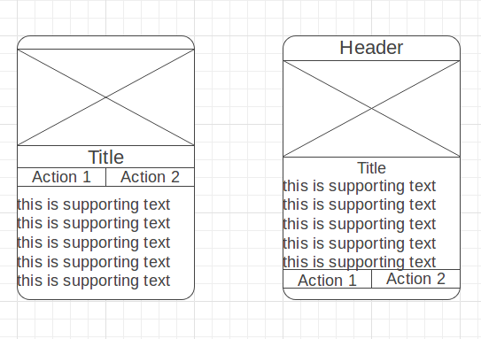

It's that easy!
...almost


<!-- .slide: data-background-image="../images/bg-mouse.jpg" -->
### Some (mobile) suggestions from google
* Media area is 16:9 or 1:1
* Main title
	* Text is 1.25rem or 1rem
	* 1.25 or 1 rem top/bottom padding
	* 1rem side padding
* Action row has 8px padding
* Supporting text
	* Text is 0.875rem
	* 1.25 or 1 rem top/bottom padding
	* 1rem side padding

Note:
If trying to understand the android design. 1rem is 16dp, 1.25rem is 25dp and 0.875 is 14dp.


<!-- .slide: data-background-image="../images/bg-mouse.jpg" -->
### Summary of google's tips
* Padding is nice
* have nice ratios

<video>
	<source data-src="videos/card-padding.webm" type="video/webm" />
</video>


<!-- .slide: data-background-image="../images/bg-mouse.jpg" -->
### More suggestions from google
* Cards margins should be a multiple of 8px
	* 8dp on small screens
	* 16px with more space
	* 24px with even more space
	* etc...


<!-- .slide: data-background-image="../images/bg-mouse.jpg" -->
### Summary of google's tips
* Margins and padding are nice
* have nice ratios


<!-- .slide: data-background-image="../images/bg-mouse.jpg" -->
### Even more suggestions from google
* Cards have a default drop shadow of 2px
* They may have a raised drop shadow of 8px


<!-- .slide: data-background-image="../images/bg-mouse.jpg" -->
### Summary of google's tips
* Drop shadows are nice
* Have a little drop shadow to give cards depth
* Increase the drop shadow to show a card is active

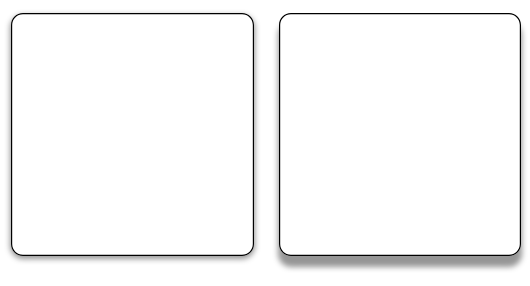


<!-- .slide: data-background-image="../images/bg-mouse.jpg" -->
### Activity
* Cut out a header, title, media, text and actions from paper
* Arrange them on another piece to make some different card designs
* Take a photo of your favourite and share it on learnline


<!-- .slide: data-background-image="../images/bg-mouse.jpg" -->
## Component UI Design


<!-- .slide: data-background-image="../images/bg-mouse.jpg" -->
Split the UI into small, reusable parts


<!-- .slide: data-background-image="../images/bg-mouse.jpg" -->
Build up a library of blocks that you can use to build your pages


<!-- .slide: data-background-image="../images/bg-mouse.jpg" -->
Develop consistant style and branding for use across your websites


<!-- .slide: data-background-image="../images/bg-mouse.jpg" -->
Reusable components are easy to develop and test in isolation and can be use to quickly build new pages that feel a part of the overall site


<!-- .slide: data-background-image="../images/bg-mouse.jpg" -->
### Different layers to Component Design
* Style
* Elements
* Components


<!-- .slide: data-background-image="../images/bg-mouse.jpg" -->
#### Style
Overall look and feel
* Colour palette
* Fonts
* Design guidelines


<!-- .slide: data-background-image="../images/bg-mouse.jpg" -->
#### Elements
Styling for basic elements. The smallest pieces of the page. They should be designed in line with the style.
* Buttons
* Headings
* Links
* Form inputs
* Paragraphs
* etc...


<!-- .slide: data-background-image="../images/bg-mouse.jpg" -->
#### Components
Larger, more complex parts of the page. They should be made of elements and may also use other, smaller components.
* Cards
* Navigation
* Modals and dialogs
* News articles


<!-- .slide: data-background-image="../images/bg-mouse.jpg" -->
### Existing component libraries
* [Bootstrap](https://getbootstrap.com/docs/4.3/components/alerts/)
* [Zurb Foundation](https://foundation.zurb.com/sites/docs/kitchen-sink.html)
* [Australian Government](https://designsystem.gov.au/components/)
* [CDU](http://www.cdu1prdweb1.cdu.edu.au/styleguide/)


<!-- .slide: data-background-image="../images/bg-mouse.jpg" -->
### Activity
* Look at your site
* Does it appear to follow a consistant design?
* Can you identify any elements you could turn into a component?


<!-- .slide: data-background-image="../images/bg-mouse.jpg" -->
## CSS Grid
* Place elements in columns and rows on a grid

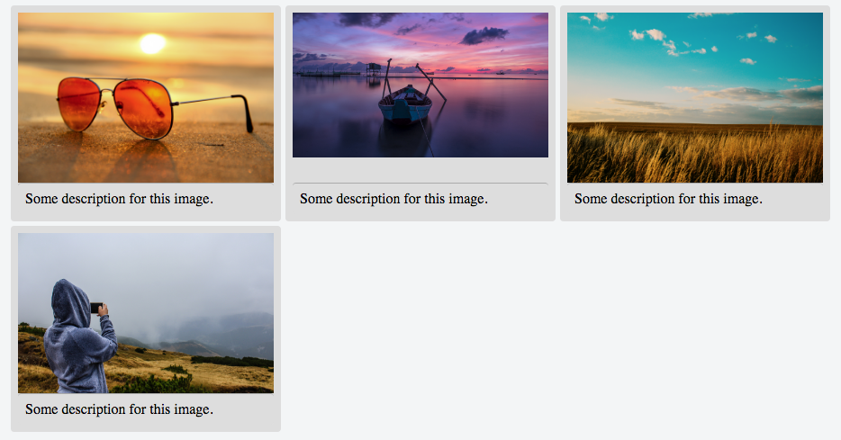


<!-- .slide: data-background-image="../images/bg-mouse.jpg" -->
### Some terminology
* A *container* holds the grid (has display: grid)
* An *item* is placed on the grid. Only direct children of the container are grid items.
* *Lines* make up the grid structure by marking out columns (vertical lines) and rows (horizontal lines).
* *Tracks* are the space between adjacent grid lines. They're the columns and rows.
* *Cells* are the space between two adjacent vertical lines and two adjacent horizontal lines. 
* *Area* is the space between any given two horizontal and two vertical grid lines.


<!-- .slide: data-background-image="../images/bg-mouse.jpg" -->
### A basic grid
<div class="col">
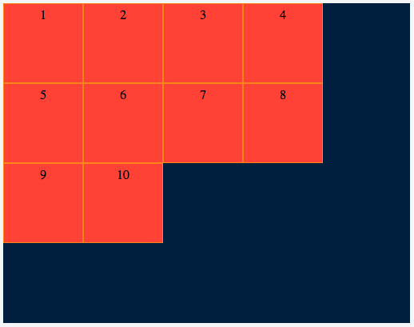 <!-- .element class="inline-image" -->

<pre class="inline-code">
<code>
.gridContainer {
	display: grid;
	grid-template-rows: repeat(4, 100px);
	grid-template-columns: repeat(4, 100px);
}
</code>
</pre>
</div>
<ul class="col">
<li>We define the size of each row using _grid-template-rows_ and each column using _grid-template-columns_.</li>
<li>We can specify each row individually or use repeat as a shortcut.</li>
<li>[https://jsfiddle.net/elvey/hwkbxxq1/](https://jsfiddle.net/elvey/hwkbxxq1/)</li>
</ul>
</div>


<!-- .slide: data-background-image="../images/bg-mouse.jpg" -->
### Spacing
<div class="col">
We can place spaces between items using grid-gap
</div>
<div class="col">
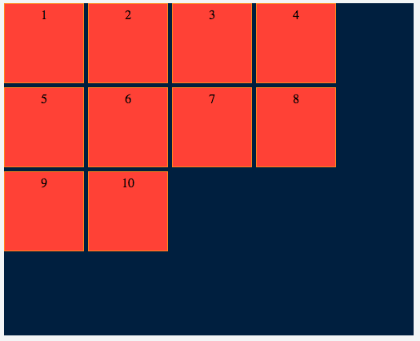

<pre class="inline-code">
```css
grid-column-gap: 5px;
grid-row-gap: 5px;

grid-gap: 5px 5px;
```
</pre>
</div>


<!-- .slide: data-background-image="../images/bg-mouse.jpg" -->
### Item placement
* If an item doesn't fit the grid we can tell the grid where to place it
* justify-items places items along the row axis

<ul class="pretty-list">
<li>
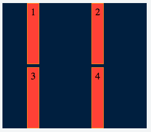
<pre class="one-line-code"><code>justify-items: center;</code></pre>
</li>
<li>
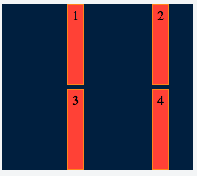
<pre class="one-line-code"><code>justify-items: end;</code></pre>
</li>
<li>
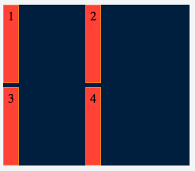
<pre class="one-line-code"><code>justify-items: start;</code></pre>
</li>
<li>
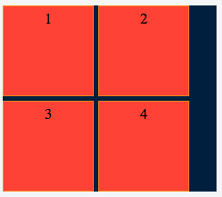
<pre class="one-line-code"><code>justify-items: stretch;</code></pre>
</li>
</ul>


<!-- .slide: data-background-image="../images/bg-mouse.jpg" -->
### Item placement
* align-items places items along the row axis

<ul class="pretty-list">
<li>
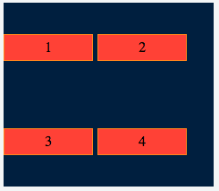
<pre class="one-line-code"><code>align-items: center;</code></pre>
</li>
<li>
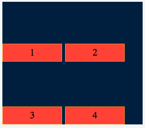
<pre class="one-line-code"><code>align-items: end;</code></pre>
</li>
<li>
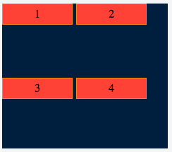
<pre class="one-line-code"><code>align-items: start;</code></pre>
</li>
<li>

<pre class="one-line-code"><code>align-items: stretch;</code></pre>
</li>
</ul>


<!-- .slide: data-background-image="../images/bg-mouse.jpg" -->
### Learn from Mozilla
Learn the terminology in the [MDN Grid Playground](https://mozilladevelopers.github.io/playground/css-grid)


<!-- .slide: data-background-image="../images/bg-mouse.jpg" -->
### Playtime
Look after your [CSS Grid Garden](http://cssgridgarden.com/)


<!-- .slide: data-background-image="../images/bg-mouse.jpg" -->
## CSS Transitions


<!-- .slide: data-background-image="../images/bg-mouse.jpg" -->
### What are CSS Transitions
* Animate the change in CSS properties


<!-- .slide: data-background-image="../images/bg-mouse.jpg" -->
### Why use CSS Transitions
* Browser optimised
* Smoother and faster than javascript animations


<!-- .slide: data-background-image="../images/bg-mouse.jpg" -->
### Examples
<video>
	<source data-src="videos/checked-transition.webm" type="video/webm" />
</video>
* [Checkbox transitions](https://codepen.io/elvey/pen/geGdzQ)
* [Hover.css](http://ianlunn.github.io/Hover/)


<!-- .slide: data-background-image="../images/bg-mouse.jpg" -->
### Transition property
* Specifies which CSS properties to transition
* Can specify multiple properties in a comma delimeted list

```css
transition-property: width, height;
```

[MDN](https://developer.mozilla.org/en-US/docs/Web/CSS/CSS_animated_properties) maintains a list of properties that can be transitioned


<!-- .slide: data-background-image="../images/bg-mouse.jpg" -->
### Transition duration
* The amount of time the transition should be animated for

```css
transition-duration: 1s;
```


<!-- .slide: data-background-image="../images/bg-mouse.jpg" -->
### Transition timing
* Function specifying timing to perform transition
* [Lots of predefined options](https://developer.mozilla.org/en-US/docs/Web/CSS/transition-timing-function)
* Made of a [Bezier curve](http://easings.net/)
* You can [define your own](https://matthewlein.com/tools/ceaser)


<!-- .slide: data-background-image="../images/bg-mouse.jpg" -->
### Transition timing
<video>
	<source data-src="videos/transition-easing.webm" type="video/webm" />
</video>
* [Codepen: CSS Transition Timing Function](https://codepen.io/mmgolden/pen/XNqROz)


<!-- .slide: data-background-image="../images/bg-mouse.jpg" -->
### Transition delay
* Specifies the amount of time to wait before starting the transition

```css
transition-delay: 0s, 1s 2s;
```


<!-- .slide: data-background-image="../images/bg-mouse.jpg" -->
### Transition delay example
<video>
	<source data-src="videos/transition-delay.webm" type="video/webm" />
</video>
* Source: [http://css3.bradshawenterprises.com/transitions/](http://css3.bradshawenterprises.com/transitions/)


<!-- .slide: data-background-image="../images/bg-mouse.jpg" -->
### Make something cool
* Open the [code pen for this class](https://codepen.io/elvey/pen/aYLQgd)
* There are 5 boxes with different properties changing on hover
* What can you make them do?
* You can change the transition for all boxes in .box or address individual boxes using .box[:nth-child(x)](https://developer.mozilla.org/en-US/docs/Web/CSS/%3Anth-child)
* Add/remove boxes for better effect and share your favourite in learnline


<!-- .slide: data-background-image="../images/bg-mouse.jpg" -->
## Prac4
* [Build a component-based design](https://online.cdu.edu.au/bbcswebdav/pid-2721700-dt-content-rid-11324544_2/xid-11324544_2)
* [Criteria](https://online.cdu.edu.au/bbcswebdav/pid-2721700-dt-content-rid-11324556_2/xid-11324556_2)


<!-- .slide: data-background-image="../images/bg-mouse.jpg" -->
### As a team
* Create a base style and element styling for your minisite
* Use your personas and feature lists as a guide
* What colours and fonts will you use?
* How should base elements like headings and links look?
* Create a stylesheet and HTML page to demonstrate
* Commit to a new team git repository
* Everybody must commit. I will use your commits to gauge your contribution


<!-- .slide: data-background-image="../images/bg-mouse.jpg" -->
### Individually
* Create a card component for your microsite
* Demonstrate your component with some sample HTML and CSS
* Use your team styles and elements
* Use your feature list and existing content
* Commit to the team repository in a new folder with your name
* You must use your own GitHub account to commit


<!-- .slide: data-background-image="../images/bg-mouse.jpg" -->
### Team Submission
* Create a new git repository called "component-design"
* Include a CSS file for your team design and a HTML document demonstrating the design
* Your HTML file should be index.html in the root of your repository
* Publish your site on GitHub Pages
* Share a link to your repository and github pages URL in the discussion board
* I will look at commits to see who does the work


<!-- .slide: data-background-image="../images/bg-mouse.jpg" -->
### Individual Submission
* Create a directory with your name in the team repository
* Include your CSS and HTML in the team repository
* Your HTML file should be called index.html
