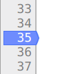
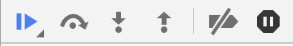
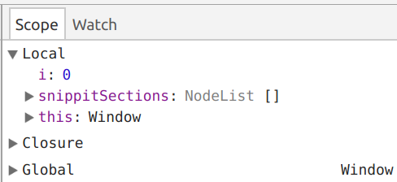

<!-- .slide: data-background-image="../images/bg-mouse.jpg" -->
# Lets Code


<!-- .slide: data-background-image="../images/bg-mouse.jpg" -->
## General tips


<!-- .slide: data-background-image="../images/bg-mouse.jpg" -->
### No deprecated elements
* Use HTML for semantics and CSS for style

```html
<b>This is the wrong way to do bold</b>
<br>
<u>This is the wrong way to underline</u>
```


<!-- .slide: data-background-image="../images/bg-mouse.jpg" -->
### Only underline links

```html
<a class="underline">I look just like a link</a>
```


<!-- .slide: data-background-image="../images/bg-mouse.jpg" -->
### Put alt text in images
* An empty string does not count

```html

```


<!-- .slide: data-background-image="../images/bg-mouse.jpg" -->
### Do not use ID in CSS
* Use class instead. It is reusable

```css
#idElem {
	// bad
}

.class-elem {
	// good
}
```


<!-- .slide: data-background-image="../images/bg-mouse.jpg" data-transition="slide-in fade-out" -->
### Use a clear class naming system
* Underscores and hyphens are a great way to make class relationships clear

```css
.card {
	// general card style
}

.card__content {
	// Styling for the card content
}
```


<!-- .slide: data-background-image="../images/bg-mouse.jpg" data-transition="slide-in fade-out" -->
### Indent your HTML and CSS so it is easy to read
* I'll be happier when I mark and your employer won't get angry when they review your code

```html
<div>
<div>sometext</div>
<p>othertext</p>
<div>
<p>more text</p>
</div>
</div>
```


<!-- .slide: data-background-image="../images/bg-mouse.jpg" data-transition="fade-in slide-out" -->
### Indent your HTML and CSS so it is easy to read
* I'll be happier when I mark and your employer won't get angry when they review your code

```html
<div>
	<div>sometext</div>
	<p>othertext</p>
	<div>
		<p>more text</p>
	</div>
</div>
```


<!-- .slide: data-background-image="../images/bg-mouse.jpg" -->
### Start with the smallest when going responsive
* Ensures your page will fit every screen size
* Use min-width in your media queries

```
@media(max-width: 800px) {
	// Try and fit everything into a smaller space
}

@media(min-width: 800px) {
	// Stretch out and use all the extra room
}
```


<!-- .slide: data-background-image="../images/bg-mouse.jpg" -->
### KeEP aN eYE on CASES
* Windows is not case sensitive
* Most web servers are
* Make sure you use the right case in filenames
* style.css != style.CSS


<!-- .slide: data-background-image="../images/bg-mouse.jpg" -->
## Debugging


<!-- .slide: data-background-image="../images/bg-mouse.jpg" -->
### Before we start
* Open the [hairsalon page](https://online.cdu.edu.au/bbcswebdav/xid-10170764_2) and attach the CSS file if it is not already
* Download and attach main.js
* What do you think this file is supposed to do?
* The file is broken, follow along with the debugger and see if you can find why


<!-- .slide: data-background-image="../images/bg-mouse.jpg" -->
### What is debugging
* Locating and fixing errors in code
* Performed at runtime
	* e.g. in the browser


<!-- .slide: data-background-image="../images/bg-mouse.jpg" -->
### How do we debug
* Chrome developer tools provides us with an _inline debugger_
* We can step through our code, line by line as it actually executes
* There are two main ways to do this


<!-- .slide: data-background-image="../images/bg-mouse.jpg" -->
### Debugging from the sources tab
1. If you open up dev tools and go to sources you will find all your js files
2. Open the file you want to debug and find the function you want to troubleshoot
3. Find a line just before where you have a problem and click the line number
4. A blue arrow appears to indicate you have set a *break point*
5. When the code gets to your break point it will pause


<!-- .slide: data-background-image="../images/bg-mouse.jpg" -->
### Open the debugger
<video>
	<source data-src="videos/debug-open.webm" type="video/webm" />
</video>


<!-- .slide: data-background-image="../images/bg-mouse.jpg" -->
### Breakpoint
* Clicking on a line number creates a breakpoint
* When the code at the breakpoint is about to execute the browser will pause and open the deugger
* Lines with breakpoints are indicated with a blue arrow




<!-- .slide: data-background-image="../images/bg-mouse.jpg" -->
### Debug controls
* Play icon resumes normal code execution
* Step over continues to the next line in the current function
* Step into pauses on the first line of the function about to be executed
* Stop out pauses on the next line of the calling (parent) function
* Can you find out what the last two do?




<!-- .slide: data-background-image="../images/bg-mouse.jpg" -->
### Checking values
* You can hover your cursor over a variable to see the value it holds
* The scope pane shows all variables in the current scope
* You can add a variable to watch in the watch pane




<!-- .slide: data-background-image="../images/bg-mouse.jpg" -->
<video>
	<source data-src="videos/debug-breakpoint.webm" type="video/webm" />
</video>


<!-- .slide: data-background-image="../images/bg-mouse.jpg" -->
### Review
* Why is main.js broken?
* Can you fix it?


<!-- .slide: data-background-image="../images/bg-mouse.jpg" -->
## Accessing the DOM


<!-- .slide: data-background-image="../images/bg-mouse.jpg" -->
### Querying Selectors

There are a bunch of ways to get elements from the DOM.

Two really stand out
* getElementById()
* getElementsByClassName()
* getElementsByTagName()
* querySelector() <!-- .element class="fragment fragment-em" data-fragment="1" -->
* querySelectorAll() <!-- .element class="fragment fragment-em" data-fragment="1" -->


<!-- .slide: data-background-image="../images/bg-mouse.jpg" -->
### But first, get Element By ID

You can call them from document (the root of the DOM tree) or an element

- getElementById() - Get the first matching element

```html
<div id="submitBtnId">Hi I'm inside ID</div>
```
```js
var btn = document.getElementsById("submitBtnId");
console.log("submit button", btn.innerHTML);
```


<!-- .slide: data-background-image="../images/bg-mouse.jpg" -->
### Get Elements By ClassName
You can call them from document (the root of the DOM tree) or an element

- getElementsByClassName() - Get the array of matching elements

```html
<div id="submitBtnClass">Hi I'm inside 1</div>
<div id="submitBtnClass">Hi I'm inside 2</div>
```

```js
var btn = document.getElementsByClassName("submitBtnClass");
console.log("submit button", btn[0].innerHTML);
```


<!-- .slide: data-background-image="../images/bg-mouse.jpg" -->
### Query selectors

Use CSS selectors to get elements from the DOM

- querySelector() - Get the first matching element
- querySelectorAll() - Get a collection of elements

You can call them from document (the root of the DOM tree) or an element


<!-- .slide: data-background-image="../images/bg-mouse.jpg" -->
```js
var btn = document.querySelector("#submitBtn");
console.log("submit button", btn);
```


<!-- .slide: data-background-image="../images/bg-mouse.jpg" -->
```js
var inputs = document.querySelectorAll(".register-form input");
console.log("registration inputs", inputs);
```


<!-- .slide: data-background-image="../images/bg-mouse.jpg" -->
### Changing Styles

Use DOM Styles objects to change CSS using JavaScript


<!-- .slide: data-background-image="../images/bg-mouse.jpg" -->
```html
<div id="submitButton">Hi I'm inside 1</div>
```

```js
var btn = document.querySelector("#submitBtn");
btn.style.color = "red";
```

* Reference: [W3 Schools](https://www.w3schools.com/jsref/dom_obj_style.asp)


<!-- .slide: data-background-image="../images/bg-mouse.jpg" -->
### Have a play
- Open index.html from hairsalon and type the following into the bottom of the console
  _ document.querySelector('thumb')
  _ document.querySelectorAll('thumb')
  _ document.querySelectorAll('nav li')
  _ document.querySelectorAll('nav > li')
  _ document.querySelector('#logo')
  _ document.querySelectorAll('#logo')


<!-- .slide: class="small-margin" data-background-image="../images/bg-mouse.jpg" -->
### Can you tell what this does?

```html
<form class="register-form">
  <label for="name">Name</label>
  <input id="name" name="name" />
  <label for="idCode">ID Code</label>
  <input id="idCode" name="id" />
</form>
```

```js
var inputs = document.querySelectorAll(".register-form input");
var registrationData = {};
for (var i = 0; i < inputs.length; i++) {
  var inputName = inputs[i].getAttribute("name");
  registrationData[inputName] = inputs[i].value;
}
```


<!-- .slide: class="small-margin" data-background-image="../images/bg-mouse.jpg" -->
### Can you Solve This?

```html
<!DOCTYPE html>
<html>
  <head>
    <meta charset="utf-8" />
    <title>JS DOM paragraph style</title>
  </head>
  <body>
    <p id="text">JavaScript Exercises - w3resource</p>
    <div>
      <button id="jsstyle" onclick="js_style()">Style</button>
    </div>
  </body>
</html>
```

```js
//Clicking on the button the font, font size, and color of the paragraph text should be be changed.
```


<!-- .slide: class="small-margin" data-background-image="../images/bg-mouse.jpg" -->
### Can you Solve This?

```html
<!DOCTYPE html>
<html><head>
<meta charset=utf-8 />
<title>Return first and last name from a form - w3resource</title>
</head><body>
<form id="form1" onsubmit="getFormvalue()">
First name: <input type="text" name="fname" value="David"><br>
Last name: <input type="text" name="lname" value="Beckham"><br>
<input type="submit" value="Submit">
</form>
</body>
</html>
```
```js
//Write a JavaScript function to get the values of First and Last name of the following form
```


<!-- .slide: class="small-margin" data-background-image="../images/bg-mouse.jpg" -->
### If you have to add new rows in a table using JavaScript, what objects/ methods would you use?? 
